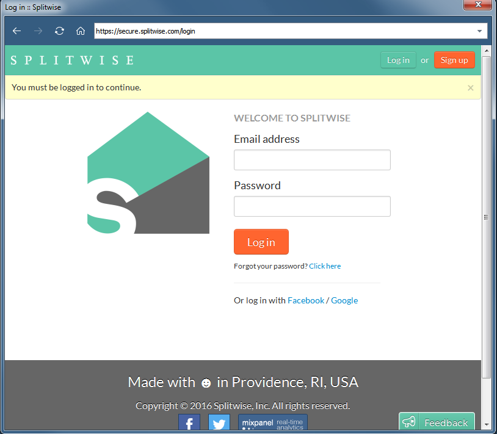
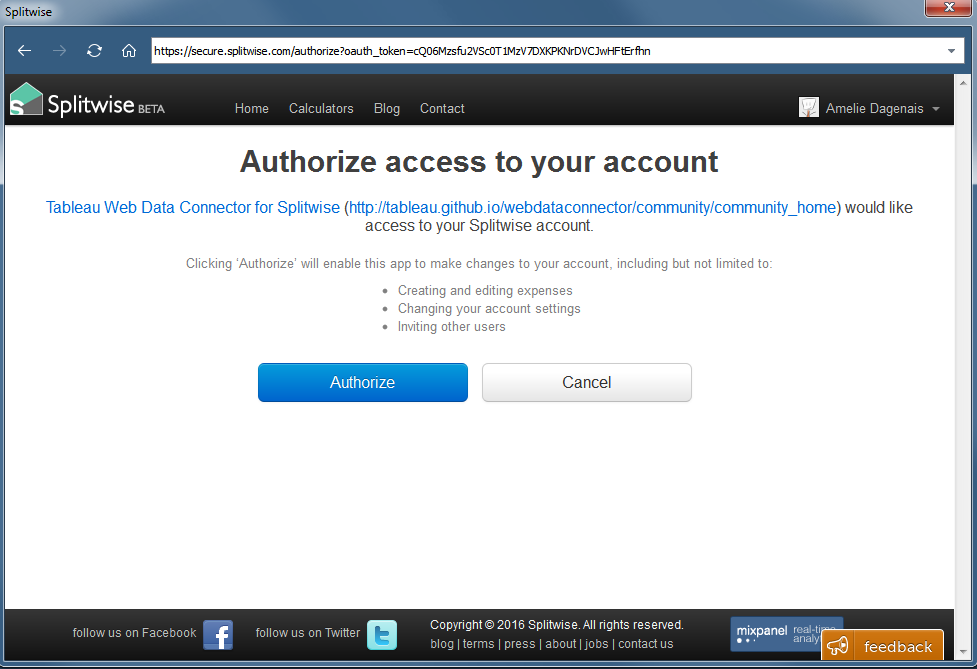
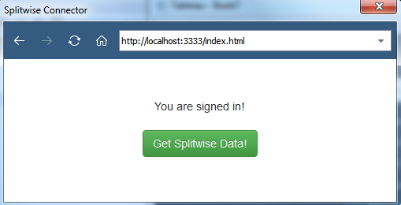
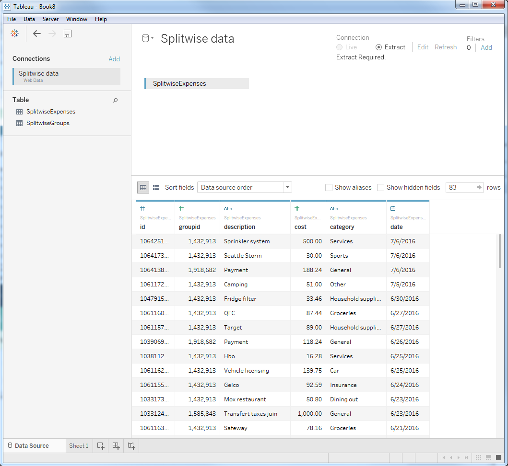
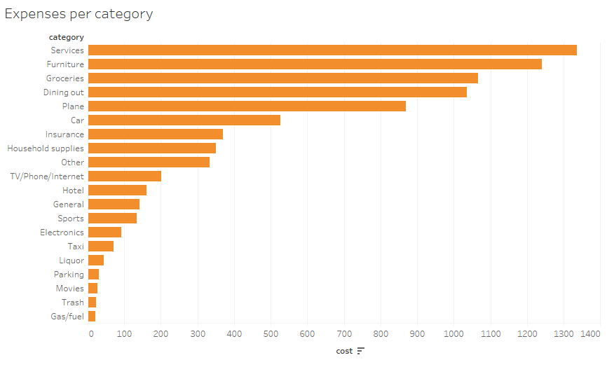
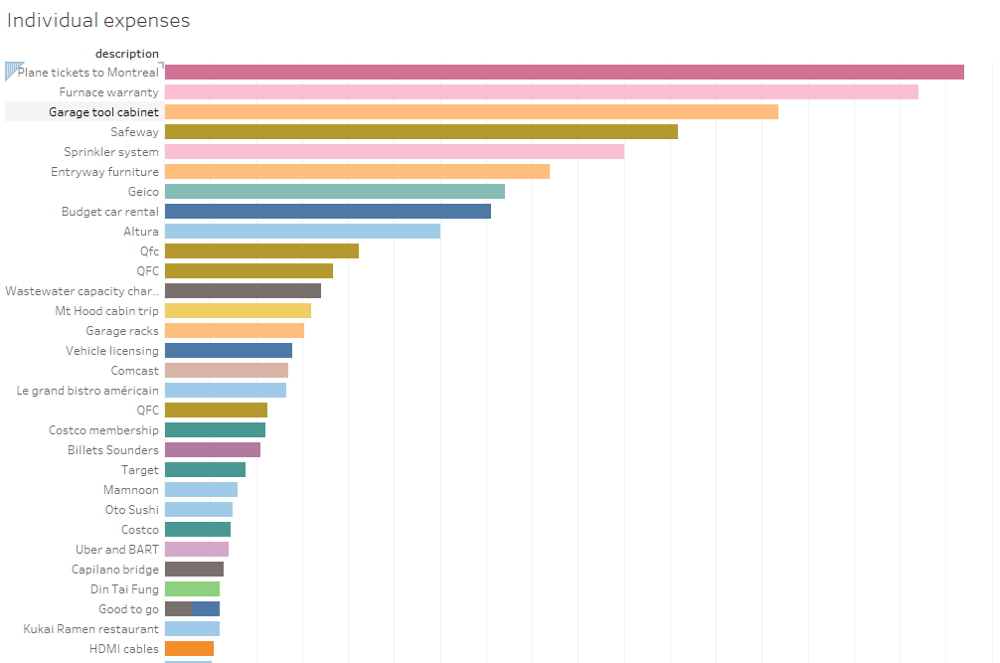
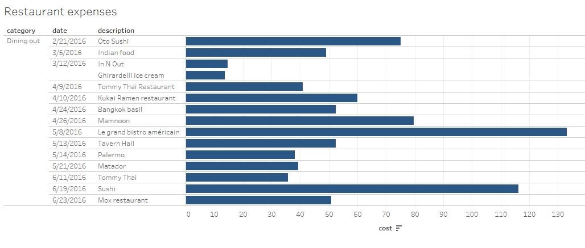

# Splitwise Web Data Connector
Tableau web data connector for Splitwise data

Splitwise is a cool app for sharing expenses between a group of friends. See www.splitwise.com. You can use it for tracking household expenses, travel expenses or just splitting lunch with friends. 

#How the web data connector

Open Tableau and choose the Web Data Connector Data Source
Type in the following url: https://tableau-wdc-splitwise.herokuapp.com. 
You should be redirected to login to Splitiwse.com

You will need to authorize the data connector to use Splitwise

At this point, you should be able get the data for each table: 

And now the fun starts, play around with your data to understand how you spend your money: 

