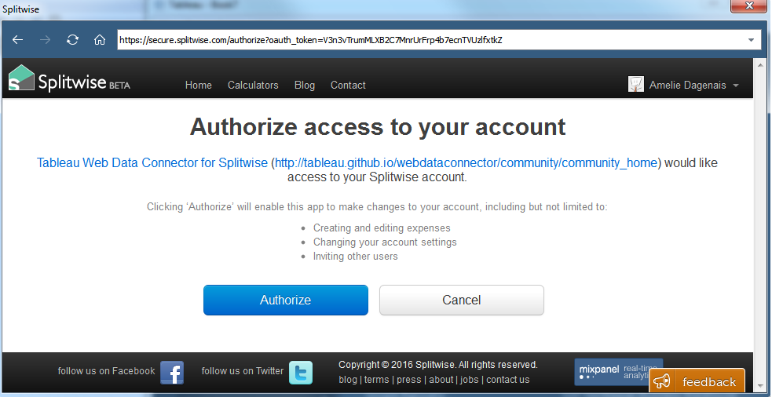

# Splitwise Web Data Connector
Tableau web data connector for Splitwise data

Splitwise is a cool app for sharing expenses between a group of friends. See www.splitwise.com. You can use it for tracking household expenses, travel expenses or just splitting lunch with friends. 

#How the web data connector

Open Tableau and choose the Web Data Connector Data Source
Type in the following url: https://tableau-wdc-splitwise.herokuapp.com. 
You should be redirected to login to Splitiwse.com

You will need to authorize the data connector to use Splitwise

Then you should be signed in and good to go!

