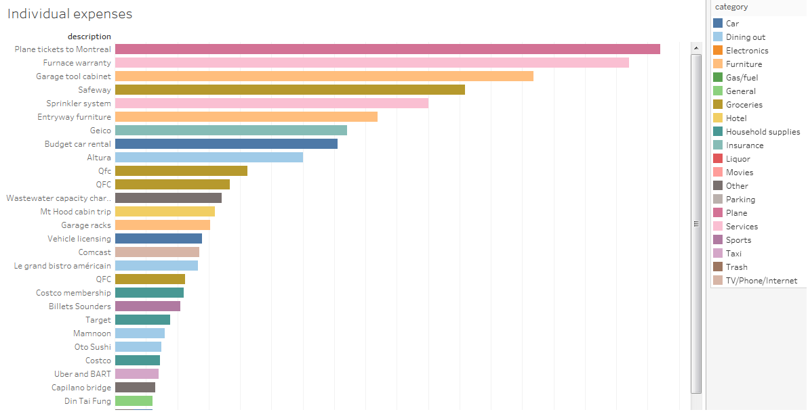

# Splitwise Web Data Connector
Tableau web data connector for Splitwise data

Splitwise is a cool app for sharing expenses between a group of friends. See www.splitwise.com. You can use it for tracking household expenses, travel expenses or just splitting lunch with friends. 

#How the web data connector

Open Tableau and choose the Web Data Connector Data Source
Type in the following url: https://tableau-wdc-splitwise.herokuapp.com. 
You should be redirected to login to Splitiwse.com

You will need to authorize the data connector to use Splitwise

At this point, you should be able get the data for each table: 

And now the fun starts, play around with your data to understand how you spend your money: 

#Technical details

I have been following the guidelines at http://dev.splitwise.com/ to use the Splitwise API. Currently the only calls used are the get_expenses and get_groups, but future plans for this WDC is to pull more for each.

##Authentication: 
The WDC uses Oauth 1.0a to connect to Splitwise. The authentication process follows the following steps: 
1) Get a consumer key by registering the app with Splitwise (one time thing)
2) Using the consumer key, ask Splitwise for a request token
3) Use the request token to direct the user to Splitwise's authorization page
4) Once the user authenticates with Splitwise, it will callback your app and provide an access token
5) All requests to the Splitwise API must use the access token

##CORS
Another tricky part of creating this web data connector was dealing with Cross-Origin requests. To do so, I'm using a proxy server to send the requests. The server is using Node.js and that's why the WDC needs to be hosted on Heroku.

